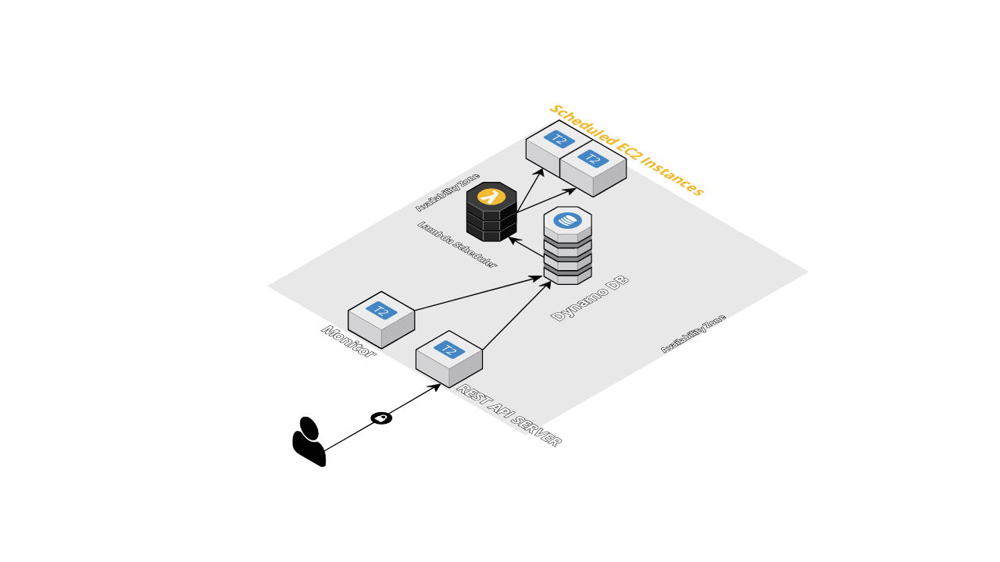

# Serverless AWS Instance Scheduler
The task was to create an API endpoint for scheduling an AWS EC2 instance using AWS Lambda. The endpoint takes JSON input from a user and can start and stop a user specified EC2 instance based on a schedule specified by the user.

## Architectural Overview
The architecture broadly contains 4 components.
 * CRUD based Flask REST API
 * Celery based monitor
 * DynamoDB as NoSQL database
 * AWS Lambda functions for carrying out the scheduling tasks
 
 The REST API and the celery monitor updates the entries in the dynamodb table depending upon the scenario. Any updates/insertions in the db creates a dynamodb stream which triggers the lamdba function. The triggered lambda function performs scheduling action on the updated ec2_schedule, i.e. starting, stopping and adding/removing tags on the ec2 instance.
 
 
## Implementation Details
All the components of the application are running as docker containers.
  - Flask with uWsgi
  - Celery Monitor
  - Redis Server (Celery Result Backend)
  - Nginx (As a reverse proxy) Container
    
[API Spec](https://redocly.github.io/redoc/?url=https://raw.githubusercontent.com/OmairK/ec2_scheduler/master/misc/apispec_1.json) for reference has been provided on redoc which also includes the spec of bonus endpoint that list all the ec2 instance schedules.

    
The IAM role used provides the following permissions
 - EC2 : FULL: TAGGING LIMITED:WRITE(Only state changing)
 - DynamoDB: LIMITED: READ,WRITE
 - CloudWatch Logs LIMITED: WRITE
 
## Setting up
 
 The project is live [here](http:/13.233.126.219)

## Development
### Prerequisites
 - Docker
 - Docker Compose
```
$ git clone git@github.com:OmairK/ec2_scheduler.git
$ cd ec2_scheduler

#env variables
$ cp .env .ok_env
$ vim .ok_env

$ docker-compose build
$ docker compose up -d

```
